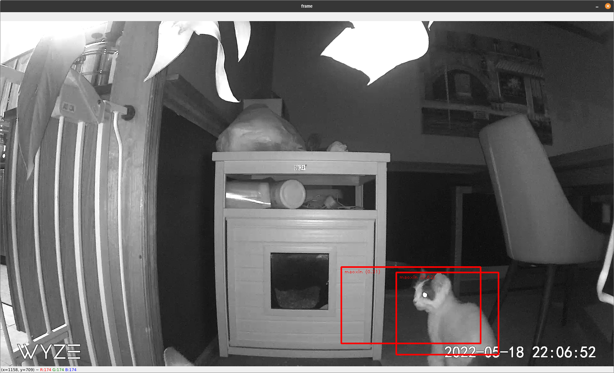

# What is this?

An experiment to train a TensorFlow Lite model to detect when my cats use their litter box. Works in conjunction with a Wyze V2 camera with the RTSP firmware installed. Eventually I hope to use this to correct bad behavior of cats doing their business right outside of the litter boxes :-(

## How does this work?

I took 69 images of my litter box (collected through a Wyze camera) and ran them through [labelImg](https://github.com/tzutalin/labelImg) to identify my cats (by name) in the images.

I then uploaded the images and xml files to a Google Colab sheet that analyzed them and created a TensorFlow Lite model.

I used OpenCV and Tensorflow for Python to connect to my Wyze camera via RTSP, load up the model, and detect my naughty cats.

## Gotchas

There were honestly so many pain points getting this up and running, that I wanted to list some of them:

- Couldn't get TensorFlow AND `tflite-model-maker` libraries running on a Mac with M1 chip [TensorFlow Forums Issue](https://discuss.tensorflow.org/t/tflite-model-maker-with-macos-12/3958)
- Issues with installing `tflite_support` and Numpy on Python 3.10, had to use [Anaconda](https://www.anaconda.com/) to build a 3.9 environment
- Issue with Anaconda installing packages [GitHub issue](https://github.com/conda/conda/issues/9367#issuecomment-558863143)

## Plans

- [ ] Add XiaoBong to the data set (he's a good cat, so not initially included with the bad cats)
- [ ] Refine model to specifically care about cats in litter box
- [ ] Connect Discord API to send alerts when a cat is detected in the litter box
- [ ] Allow live training of the model by replying to the Discord bot with yes/no if detection was accurate
- [ ] Detect cats that do their business on the mats in front of the litter box and take...corrective action.
